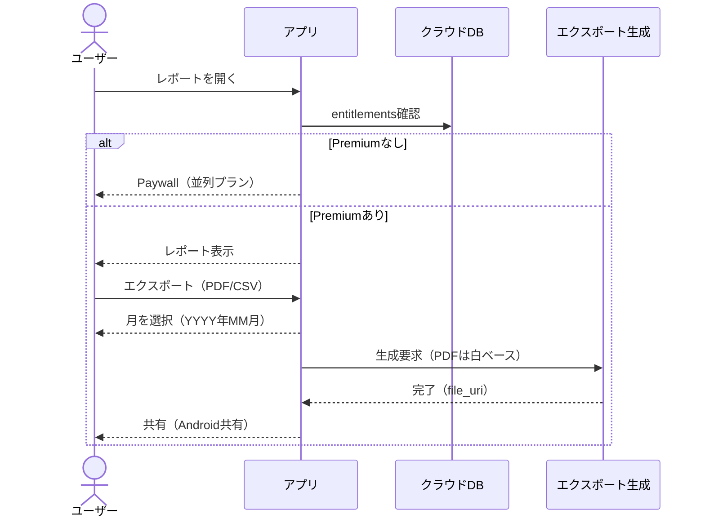
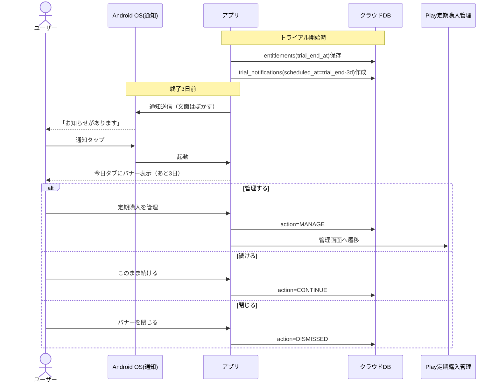

# おくすりずむ 要件定義（統合版）

- 対象：Androidアプリ
- 目的：飲み忘れ防止（通知＋アプリ内での正確な服薬確定）
- トーン：やさしい・かわいい・清潔感（幼すぎない）
- 課金：無料（広告なし）＋Premium（月額＋買い切り）

---

## 1. 用語
- **枠（dose_event）**：同一予定時刻の服薬グループ（通知は枠単位で1つ）
- **枠内アイテム（dose_event_item）**：枠の中の各お薬
- **アクティブ薬**：通知対象の薬（アーカイブ除外）
- **アーカイブ**：削除せず退避（無料枠の薬数上限カウントから除外）
- **Premium**：有料権利（サブスク/月額 or 買い切り）

---

## 2. ユーザー体験（セリフ形式ユーザーストーリー）

### 2.1 コア体験（服薬）
> ユーザー「通知きた。薬名が出ないから安心」  
> ユーザー「タップしたら“今日”タブ。上に日付ピル、画面は“朝・昼・夜”で分かれてる」  
> ユーザー「今の枠がピンクでふわっとハイライト。時間は小さくて圧がない」  
> ユーザー「開くと写真つきで薬が並ぶ。飲んだやつだけチェックして“確定（ミント）”」  
> ユーザー「残りは10/30/60分でスヌーズ。未チェック分だけ保留になる」

### 2.2 Premium体験（レポート・共有）
> ユーザー「今月の達成率と、飲み忘れ傾向を見たい」  
> アプリ「Premiumで週/月レポートとエクスポートが使えるよ」  
> アプリ（Paywall）「月額 ¥360（14日無料）／買い切り ¥1,980 を同じ画面で選べます」  
> ユーザー「まず14日無料で試す」  
> ユーザー「“2025年12月”を選んでPDFを出す。白ベースで読みやすくて病院に出せる」

### 2.3 トライアル終了リマインド
> （終了3日前）  
> OS通知「お知らせがあります」（課金・金額は書かない）  
> ユーザー「タップ」  
> アプリ（今日タブのバナー）「無料期間の終了が近いよ（あと3日）。続ける？見直す？」  
> ユーザー「押し売りじゃないのが安心。必要ならPlayで管理できる」

---

## 3. 機能要件（アプリ機能）

### 3.1 認証・アカウント
- Googleログインのみ
- 機種変更時の復元（同一Googleアカウントで同期復元）
- アカウント削除（データ削除含む）※運用要件で必須

### 3.2 お薬管理
- お薬の登録/編集/削除
- お薬に画像（ユーザー撮影写真）を設定できる
- 1回量：**数字＋単位**（例：1 錠 / 2 包 / 5 mL）
  - 薬ごとに固定（回ごとの変更なし）
- アーカイブ（退避）
  - 無料版の薬数制限カウントから除外
  - 削除せず残る（不安を増やさない）

### 3.3 スケジュール（薬ごと）
MVPで対応するスケジュール：
- 毎日（複数時刻）
- 曜日指定
- ◯時間おき（例：8時間ごと）
- 期間限定（開始日〜終了日）

### 3.4 通知
- 服薬予定時刻に通知を送る
- **同一時刻の薬はまとめて1通知**
- 通知本文はぼかす（薬名を表示しない）
- 通知は基本1回（未操作で自動再通知しない）
- 通知タップ → アプリ起動 → **今日タブ**へ遷移し該当枠をハイライト

### 3.5 服薬の確定（正確さ重視）
- 枠を開き「飲んだ薬だけ」をチェックして確定
- 予定時刻と実時刻を両方保存
- 1つだけの枠でも、通知からワンタップ確定はしない（必ずアプリ内で確認して確定）

### 3.6 スヌーズ
- 固定選択：10分 / 30分 / 60分
- 枠の中で一部だけ飲んだ場合：
  - **未チェック分だけまとめてスヌーズ**
- スヌーズ中は飲み忘れ判定の対象外

### 3.7 飲み忘れ判定
- **次の服薬予定が来た瞬間**に、前枠が未完了なら「飲み忘れ」に更新
- ただしスヌーズ中は除外
- 後から「遅れて飲んだ」に修正できる（実時刻を記録）

### 3.8 今日タブ（履歴吸収）
- 上部：日付ピル（今日/昨日/2日前…）＋左右スワイプで日付移動
- 本文：**朝・昼・夜**セクション分け（時間は小さく補助情報）
- 各セクション内に枠カード（状態が一目）

### 3.9 お薬タブ
- **写真つきカード一覧（画像が主役）**
- 写真の表示形：**角丸スクエア**
- 写真未設定時はプレースホルダー（ミント/クリーム＋線画ピル）

### 3.10 設定タブ
- Googleログイン状態（ログアウト含む）
- Premium案内/購入/復元
- 通知が無効な場合の案内（OS設定への導線）
- 利用規約/プライバシーポリシー/お問い合わせ
- アカウント削除

---

## 4. UIデザイン要件

### 4.1 コンセプト
- LPと同じ世界観を強く継承（パステル、丸角、ふんわり影、波形）
- かわいいが幼すぎない（派手さ・煽り・詰め込み禁止）

### 4.2 デザイントークン（固定）
- mint: #A8E6CF
- mint-dark: #76C893（Primary）
- pink: #FFB7B2
- pink-dark: #FF9AA2（Attention/Highlight）
- cream: #FFF9F0（Surface）
- text: #555555 / text-dark: #333333
- radius: 24px（主要カード）、16px（小カード）、ボタンはピル型
- shadow：ふんわり（濃い影禁止）
- icon：線画、丸端、stroke統一（2〜2.5）

### 4.3 ナビゲーション
- 下部タブ：**今日／お薬／設定**（3タブ固定）
- 選択中：mint-dark、未選択：text系

### 4.4 状態表現（安心重視）
- 未完了：pink-dark（強調）＋薄ピンク面
- 完了：mint-dark（チェック）
- スヌーズ：cream面＋mintアクセント
- 飲み忘れ：ピンク寄り（罪悪感を煽る赤は禁止）

### 4.5 モーション
- 200〜300msで“ふわっ”
- 常時動く演出は禁止

### 4.6 アクセシビリティ
- タップ領域：48dp目安
- 薄灰色本文の多用禁止（補助のみ）
- 状態が色だけに依存しない（アイコン/文言/枠線も併用）

---

## 5. アプリ内課金 要件

### 5.1 課金モデル
- 無料（広告なし）＋Premium

### 5.2 商品・価格（確定）
- Premium（月額サブスク）：**¥360/月**
  - **14日無料トライアル**（月額のみ）
- Premium Lifetime（買い切り）：**¥1,980**
- 年額プランなし

### 5.3 無料版の制限（確定）
- 薬登録：**アクティブ5個まで**
- アーカイブは5個カウントに含めない

### 5.4 Premiumで解放（確定）
- 薬：無制限
- 週/月レポート（達成率、飲み忘れ傾向）
- エクスポート：PDF/CSV
  - 期間：**月単位（YYYY年MM月）**
  - PDFデザイン：提出用（白＋黒、ミント少し）

### 5.5 Paywall（誠実版）
- 月額（14日無料）と買い切り（¥1,980）を**同一画面に並列表示**
- 表示トリガー：
  1) 6個目の薬追加時
  2) レポート/エクスポートを開く時
  3) 設定→Premium
- 必須文言：
  - 「14日無料の後、自動更新」
  - 「請求回避は終了前キャンセル」
  - 「キャンセルはGoogle Playの定期購入から」
- 押し売り・煽りは禁止

### 5.6 Premium失効時の扱い（重要）
- データ削除なし
- 6個以上の既存薬は閲覧OK
- 無料状態では：
  - 新規追加不可
  - アーカイブ解除でアクティブ5個超は不可
- 「整理（アーカイブ）」と「Premium再開」を同時提示

### 5.7 トライアル終了リマインド（確定）
- 終了3日前に実施
- **アプリ内バナー＋OS通知**
- OS通知文面はぼかす（課金・金額を露骨に書かない）
- 通知タップ → 今日タブ表示 → バナー表示
- バナーアクション：
  - 「このまま続ける」（何もしない）
  - 「定期購入を管理」（Playの管理画面へ）
  - 「閉じる」

### 5.8 計測イベント（PDCA）
- paywall_view / purchase_start / purchase_success / restore_success
- trial_start / trial_remind_shown / trial_remind_open / trial_to_paid / trial_manage_open
- report_view / export_pdf / export_csv
- med_limit_hit / archive_from_limit
- premium_expired

---

## 6. データベース設計（テーブル構造）

### 6.1 users
| column | type | notes |
|---|---|---|
| id | string | PK |
| google_uid | string | UNIQUE |
| created_at | datetime |  |
| updated_at | datetime |  |

### 6.2 medications
| column | type | notes |
|---|---|---|
| id | string | PK |
| user_id | string | FK users |
| name | string |  |
| photo_url | string | nullable |
| dose_amount | int |  |
| dose_unit | string |  |
| is_active | boolean |  |
| is_archived | boolean | 無料5個判定はfalseのみ |
| archived_at | datetime | nullable |
| created_at | datetime |  |
| updated_at | datetime |  |

### 6.3 schedules
| column | type | notes |
|---|---|---|
| id | string | PK |
| medication_id | string | FK medications |
| type | enum | DAILY / WEEKLY / INTERVAL |
| start_date | date | nullable |
| end_date | date | nullable |
| times_json | json | DAILY用 ["08:00","20:00"] |
| weekdays_json | json | WEEKLY用 [1,3,5] |
| interval_hours | int | INTERVAL用 |
| anchor_time | datetime | nullable |
| created_at | datetime |  |
| updated_at | datetime |  |

### 6.4 dose_events（枠）
| column | type | notes |
|---|---|---|
| id | string | PK |
| user_id | string | FK users |
| scheduled_at | datetime | index |
| status | enum | PENDING / TAKEN / MISSED |
| created_at | datetime |  |
| updated_at | datetime |  |

### 6.5 dose_event_items（枠内の薬）
| column | type | notes |
|---|---|---|
| id | string | PK |
| dose_event_id | string | FK dose_events |
| medication_id | string | FK medications |
| item_status | enum | PENDING / TAKEN / MISSED / SNOOZED |
| scheduled_at | datetime | 予定（枠と同値でも保持可） |
| taken_at | datetime | nullable（実時刻） |
| snoozed_until | datetime | nullable |
| created_at | datetime |  |
| updated_at | datetime |  |

### 6.6 entitlements（課金権利）
| column | type | notes |
|---|---|---|
| user_id | string | PK/FK users |
| premium_active | boolean |  |
| source | enum | SUBSCRIPTION / LIFETIME |
| expires_at | datetime | nullable |
| trial_end_at | datetime | nullable |
| updated_at | datetime |  |

### 6.7 purchases（購入ログ）
| column | type | notes |
|---|---|---|
| id | string | PK |
| user_id | string | FK users |
| product_id | string |  |
| product_type | enum | SUBSCRIPTION / ONE_TIME |
| purchase_token | string | 復元/検証 |
| purchased_at | datetime |  |
| status | enum | ACTIVE / EXPIRED / CANCELED / REFUNDED |
| raw_json | json | 最小限 |

### 6.8 exports（エクスポート）
| column | type | notes |
|---|---|---|
| id | string | PK |
| user_id | string | FK users |
| format | enum | PDF / CSV |
| year_month | string | YYYY-MM |
| status | enum | QUEUED / DONE / FAILED |
| created_at | datetime |  |
| file_uri | string | nullable |

### 6.9 trial_notifications（トライアルリマインド）
| column | type | notes |
|---|---|---|
| id | string | PK |
| user_id | string | FK users |
| type | enum | TRIAL_END_MINUS_3D |
| scheduled_at | datetime |  |
| push_sent_at | datetime | nullable |
| opened_at | datetime | nullable |
| banner_shown_at | datetime | nullable |
| action | enum | nullable: CONTINUE / MANAGE / DISMISSED |
| created_at | datetime |  |

---

## 7. シーケンス図（mermaid）

### 7.1 通知→今日タブ→確定/スヌーズ
```mermaid
sequenceDiagram
  actor U as ユーザー
  participant OS as Android OS(通知)
  participant App as アプリ
  participant DB as クラウドDB

  OS-->>U: 通知「服薬の時間です」（薬名なし）
  U->>OS: 通知をタップ
  OS->>App: 起動 + 対象時刻枠

  App-->>U: 今日タブ（朝/昼/夜）表示
  App-->>U: 該当枠カードをピンクでハイライト
  U->>App: 枠カードを開く
  App-->>U: 写真つき薬リスト（飲んだ分だけチェック）

  U->>App: 確定（mintボタン）
  App->>DB: dose_event_items更新(TAKEN, taken_at)
  DB-->>App: OK
  App-->>U: 状態反映

  alt スヌーズ
    U->>App: 10/30/60分スヌーズ（未チェック分）
    App->>DB: snoozed_until保存
    App->>OS: 再通知スケジュール
  end
````

### 7.2 6個目追加→Paywall or アーカイブ整理

```mermaid
sequenceDiagram
  actor U as ユーザー
  participant App as アプリ
  participant DB as クラウドDB
  participant Play as Google Play課金

  U->>App: 6個目の薬を追加
  App->>DB: アクティブ薬数チェック（is_archived=false）
  DB-->>App: 5件（上限）

  App-->>U: 上限到達（Paywall + 整理導線）

  alt Premium購入
    U->>App: 月額（14日無料）or 買い切りを選択
    App->>Play: 購入フロー開始
    Play-->>App: purchaseToken
    App->>DB: purchases保存 + entitlements更新
    DB-->>App: premium_active=true
    App-->>U: 追加を続行
  else 整理（アーカイブ）
    U->>App: 既存薬をアーカイブ
    App->>DB: medication.is_archived=true
    DB-->>App: OK
    App-->>U: 無料のまま追加を続行
  end
```

### 7.3 レポート→月選択→PDF/CSVエクスポート



### 7.4 トライアル終了3日前：通知＋バナー→管理



---

## 8. 非機能・運用要件（追加で必要）

- プライバシーポリシー／利用規約／免責（医療助言しない）をアプリ内・ストア両方に用意
    
- 問い合わせ導線（メール/フォーム）
    
- クラッシュレポート・ログ収集（個人情報に配慮）
    
- 通知権限が拒否/無効の場合のガイド
    
- データ削除（アカウント削除）要求への対応
    
- セキュリティ：
    
    - 通信の暗号化（HTTPS）
        
    - 購入権利の検証（可能ならサーバ側でも検証）
        
    - エクスポートファイルの扱い（端末保存・共有時の注意）
        
- オフライン耐性：
    
    - オフラインでも服薬記録はできる
        
    - オンライン復帰時に同期
        
- 対応OS：Android 8.0以上（LPに合わせる）
    
- アクセシビリティ：最低限のコントラスト、タップ領域、状態表現
    

---

## 9. 受け入れ基準（抜粋）

- 通知は薬名を表示しない
    
- 通知タップで今日タブに遷移し該当枠がハイライトされる
    
- 服薬確定は必ずアプリ内で「飲んだ薬だけチェック→確定」
    
- スヌーズは10/30/60、未チェック分だけが対象
    
- 飲み忘れ判定は「次の予定が来た瞬間」（スヌーズ中は除外）
    
- 今日タブは朝/昼/夜セクション＋日付ピル＋左右スワイプ
    
- 無料はアクティブ薬5個まで（アーカイブはカウントしない）
    
- Premiumは月額¥360（14日無料）＋買い切り¥1,980、Paywallは並列表示
    
- PDF/CSVは月単位、PDFは白ベースで読みやすい
    
- トライアル終了3日前に「通知＋バナー」でやさしくリマインド（文面はぼかす）
    

---
